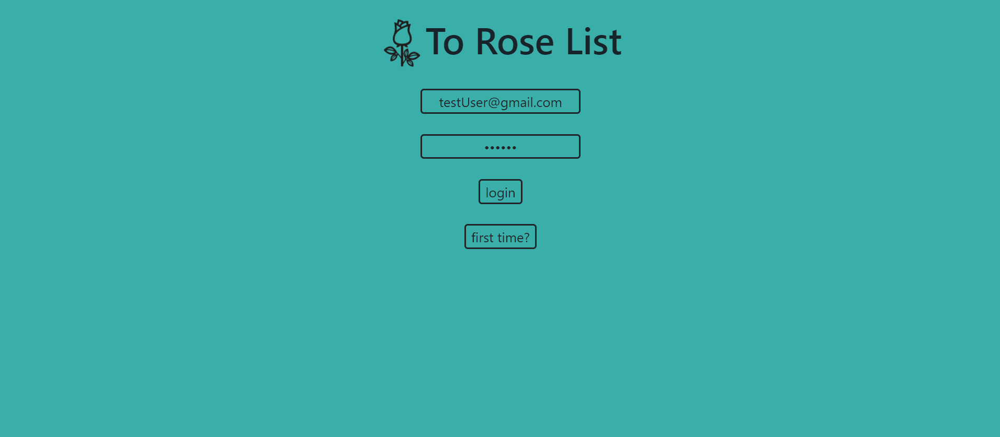

# README

 To Rose List 

 
    <a href="#sobre">Sobre</a>
    <a href="#funcionalidades">Funcionalidades</a>
    <a href="#tecnologias">Tecnologias</a>
    <a href="#Autor">Autor</a>
 

 # Sobre
 

 
Simples to do list, com sistema de login, salvando a lista de cada usuário dentro do banco de dados do firebase.

 
Você mesmo pode conferir o projeto clicando nesse <a href="https://yutaronegi.github.io/toRoseList/">Link</a>

 
Você pode usar a minha conta teste ou ate mesmo criar sua própria conta

    <ul>
    <li>Login: testUser@gmail.com</li>
    <li>Senha: 123456</li>
 </ul>

 
O site está 100% em inglês para treinar o meu desenvolvimento com projetos em inglês

 # Funcionalidades 
<ul>
    <li>Criar conta</li>
    <li>Entrar na conta</li>
    <li>Sair da conta</li>
    <li>Acessar lista salva na conta</li>
    <li>Criar Lista</li>
    <li>Deletar Lista</li>
    <li>Editar Lista</li>
 </ul>

 # Tecnologias
 <ul>
    <li>HTML</li>
    <li>CSS</li>
    <li>Javascript</li>
    <li>Jquery</li>
    <li>Firebase</li>
    <li>Bootstrap</li>
 </ul>

 # Autor

 <ul>
    <li>Yutaro Negi</li>
    <li><a href="https://www.linkedin.com/in/yutaronegi/">Linkedin</a></li>
    <li>(11) 94194-5061</li>
    <li>souza_yutaro@hotmail.com</li>
 </ul>

